# Obsidian 微信一鍵同步排版助手 (Markdown to WeChat MP Sync)

<p align="left">
    
    
    
</p>

<p align="left">
    <a href="./README.md">简体中文</a>
    ｜
    繁體中文
    ｜
    <a href="./README_en.md">English</a>
</p>

一鍵排版 Markdown 筆記並完美無縫同步至微信公眾號草稿匣，包含圖片自動上傳微信 CDN、智慧擷取封面及支援自訂 CSS 佈景主題。

---

## 0 支持本專案

本外掛 **100% 永久免費且開源**，未來也一直會是！

不過開發與維護的過程還是消耗了許多 AI token 與時間精力。所以如果這個外掛有幫助到您，例如幫您節省了時間、提升了寫作體驗，不妨請我吃碗沙縣小吃（或喝杯咖啡）！

您的支持將直接幫助我補血，並持續驅動後續的功能更新！🚀

<div align="center">
  
  
</div>

---

## 1 核心功能

### 1.1 永久免費 🆓

正如上述，本外掛永久免費且開源。（向會員訂閱費宣戰！）

### 1.2 圖片自動上傳 🖼️

可以自動將筆記中的本機圖片上傳至公眾號的素材庫，並嵌入到文章對應位置，真正實現一鍵同步。在我看來這是最大的痛點，因此必須從 1.0 版本開始就直接支援。
  
### 1.3 即時預覽 👀

類似mdnice的體驗，左邊是ob原生的筆記編輯區，右邊是即時更新的渲染預覽效果，支援同步捲動。

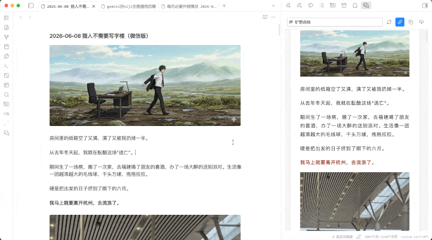

### 1.4 自訂 CSS 🎨

內建 HTML 渲染器，支援自訂 CSS，想要什麼樣的排版風格完全由您決定。（當然，圖片中間那種樣式不推薦）

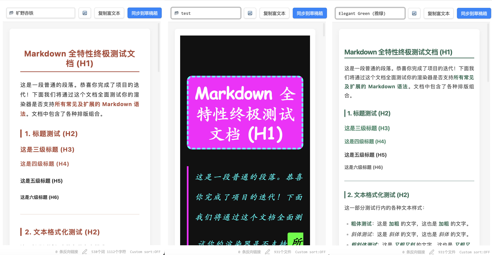

### 1.5 一鍵同步 🚀

每次只需按一個按鈕，即可將帶有樣式、圖片的筆記同步到公眾號草稿匣，享受絲滑體驗。

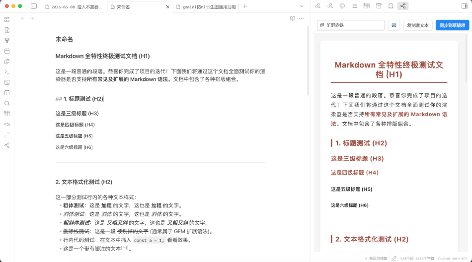

### 1.6 自動擷取首張圖片作為封面 📔

告別繁瑣的封面設定，只要將尺寸合適的圖片直接放在文章開頭即可。

後續如有需要，也可以在同步之後，再前往公眾號後台修改。

### 1.7 複製到剪貼簿（備用方案）📋

如果臨時遇到 Bug 或網路連線問題，也可以手動將渲染好的文章複製到剪貼簿，然後貼上到公眾號官方編輯器，避免浪費辛苦設定好的 CSS 樣式。

---

## 2 安裝方式 🛠️

### 方法一：透過社群外掛市場安裝（推薦）
1. 打開 Obsidian 的 **設定 (Settings)**。
2. 進入 **社群外掛程式 (Community plugins)** -> **瀏覽 (Browse)**。
3. 搜尋 `Markdown to WeChat MP Sync`。
4. 點擊 **安裝 (Install)** 並 **啟用 (Enable)**。

### 方法二：手動安裝
1. 在 [GitHub Releases](https://github.com/HanochShi/obsidian_md2wechat/releases) 頁面下載最新發布的版本檔案（包含 `main.js`, `manifest.json`, `styles.css`）。
2. 在您儲存庫 (Vault) 的 `.obsidian/plugins/` 路徑下建立一個名為 `obsidian-md2wechat` 的子資料夾。
3. 將下載的 3 個檔案放入該資料夾中。
4. 返回 Obsidian 的「社群外掛程式」設定面板，重新整理並啟用該外掛。

---

## 3 執行前的設定

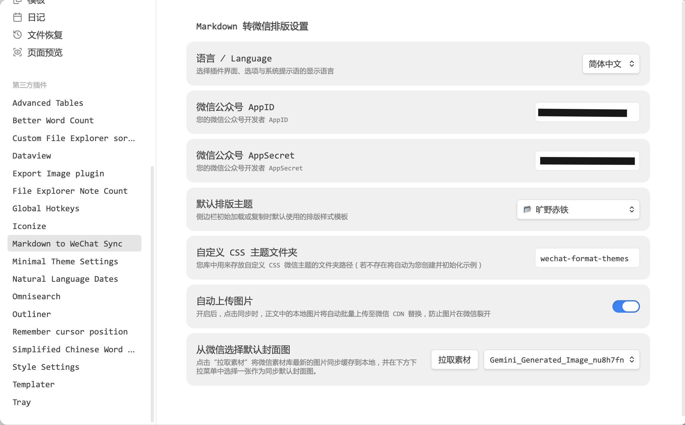

### 3.1 微信公眾號 AppID & AppSecret

自動同步功能的實現，主要是基於公眾號官方提供的 API 介面。為了呼叫這些介面，我們需要取得自己公眾號的 AppID 和 AppSecret，並將其設定到外掛的設定中。

#### 1

首先，進入自己的公眾號後台，在左側選單列中選擇 `設定與開發` -> `開發介面管理`。

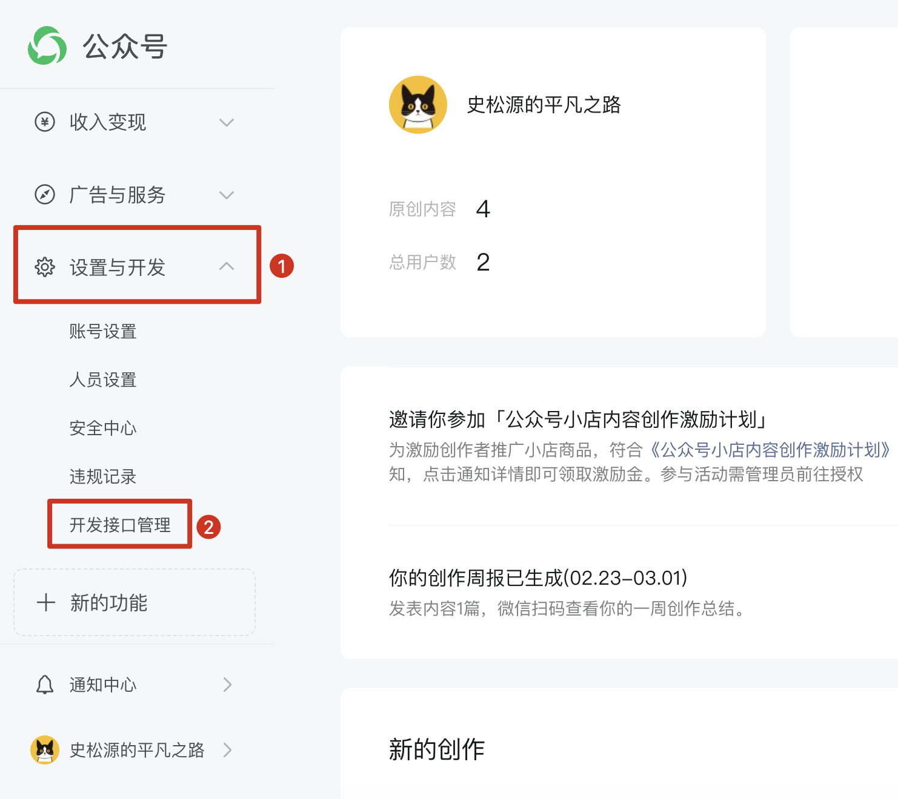

#### 2

此時，會看到如下圖的提示頁面，點擊紅框中的連結，進入微信開發者平台。

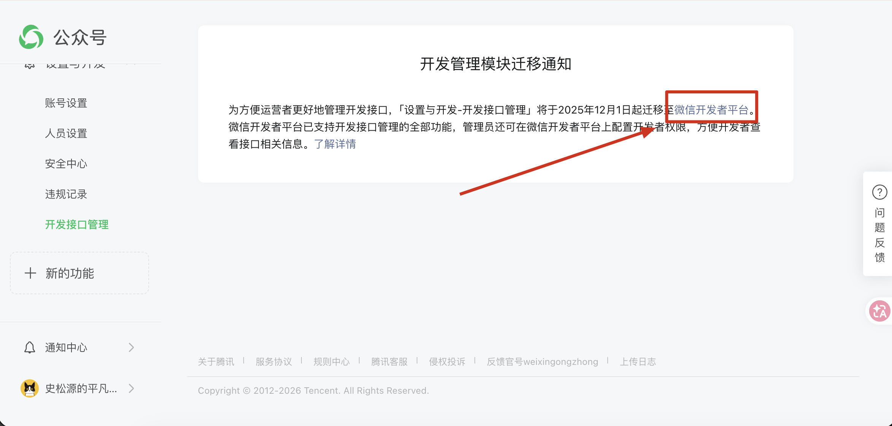

#### 3

首次進入時需要掃碼登入，用手機微信掃碼即可。

登入後預設進入的是小程式的設定頁面。我們需要點擊左上角的 `我的業務與服務`，在彈出的下拉式選單中選擇 `公眾號`，切換到公眾號的設定頁面，如下圖所示。

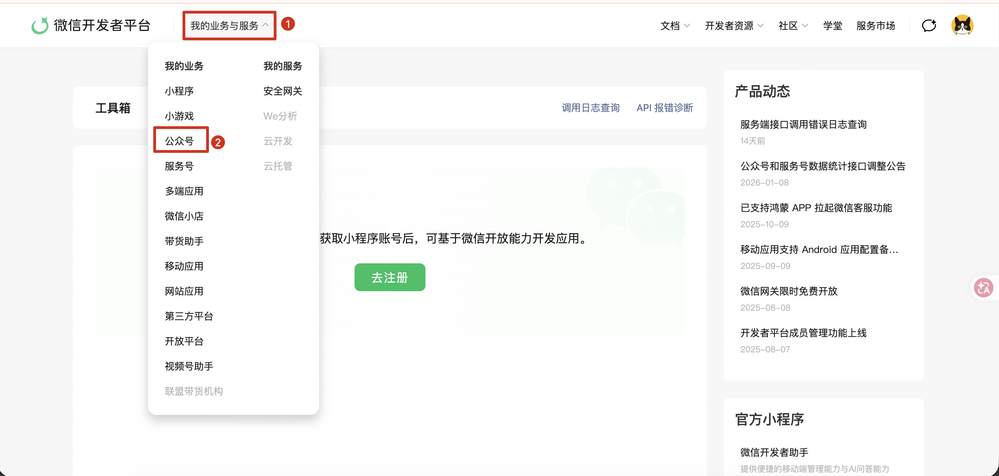

#### 4

向下捲動頁面直到看見 `開發金鑰` 這一組設定。在 `AppSecret` 的右側應該會有一個 `啟用` 按鈕。我這裡因為已經啟用過，所以顯示的是 `重設` 與 `凍結`。

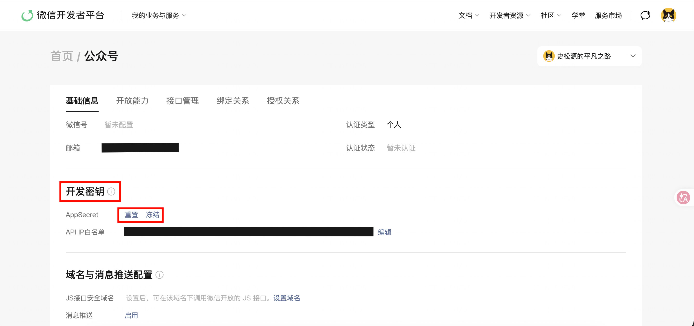

點擊 `啟用` 按鈕，這一步同樣需要微信掃碼授權。

授權完成後會出現如下圖的彈出視窗。請注意，AppSecret 只會在此時顯示一次，關閉視窗後將無法再次查看，後續如果遺失只能重設，因此最好先將其複製並妥善保存。

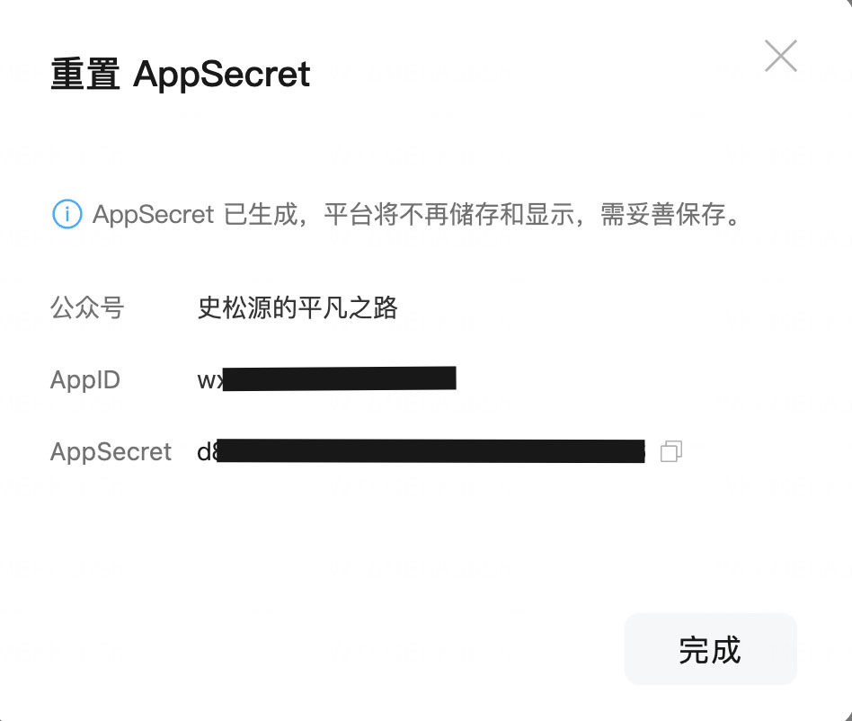

將這裡的 AppID 和 AppSecret 分別複製並貼上到外掛設定中對應的文字方塊裡。

#### 5

最後一步，還需要把自己電腦的外部 IP（實體 IP / Public IP）加入微信開發者平台的 IP 白名單裡，位置就在先前啟用 AppSecret 按鈕的下方。

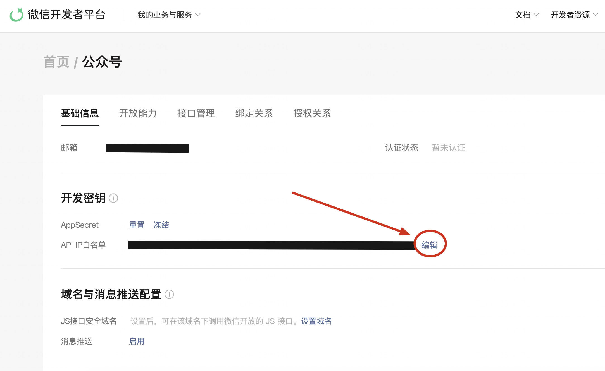

我這裡因為已經加入了多個 IP，所以 `編輯` 按鈕被擠到了右邊。首次設定時，該按鈕應該在 `重設` 按鈕的正下方。

點擊 `編輯` 按鈕後，會彈出新增 IP 的視窗，將自己的外部 IP 貼上即可。如果不知道自己的外部 IP 是多少，可以前往 [https://tool.lu/ip](https://tool.lu/ip) 查詢。

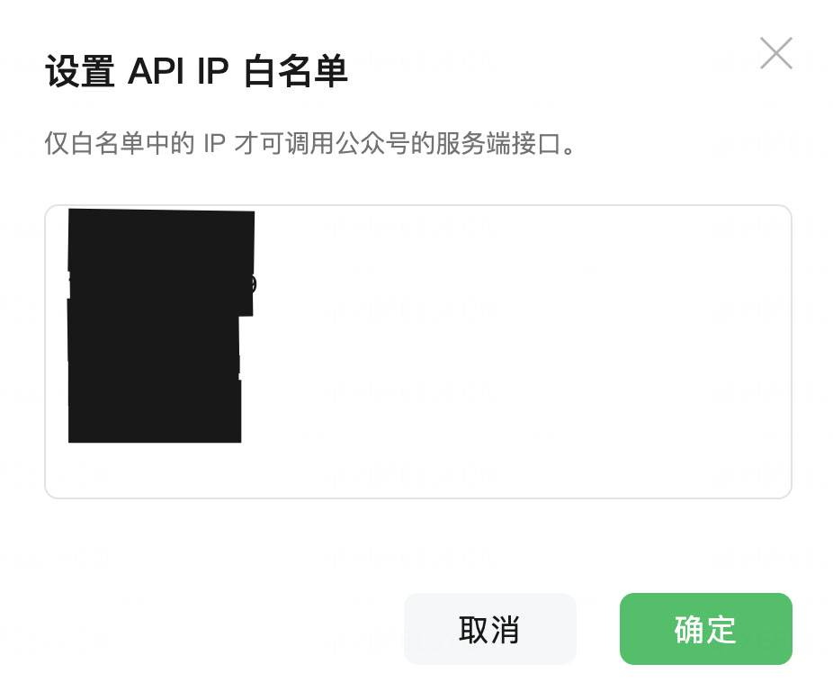

**注意事項 1**：如果需要設定多個 IP，每行一個 IP 即可，不需要任何分隔符號（例如逗號、分號）。

**注意事項 2**：如果您使用了代理伺服器（例如 VPN 或翻牆軟體），那麼不同節點對應的外部 IP 也不一樣。每次更換節點後，需要重新查詢一下目前的外部 IP，並一併加入白名單裡，否則會導致同步失敗。

**注意事項 3**：此處不支援填寫 IPv6 位址。如果您不知道什麼是 IPv6，忽略即可。

### 3.2 預設封面設定

公眾號要求在儲存草稿時必須有一張封面圖，所以為了確保每次都能同步成功，我們需要設定一張預設封面圖，用來在文章沒有任何圖片時充當封面。

這個預設封面相當於只是先佔個位置，後續可以隨時在公眾號後台手動替換。所以其實也沒那麼重要，關鍵是一定要有一張，不能沒有。

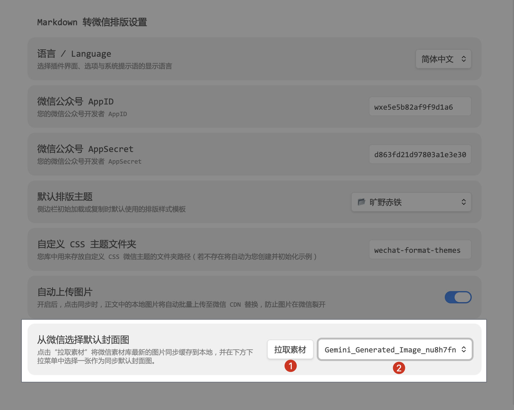

在進行這一步之前，需要先確保 AppID、AppSecret 與 IP 白名單已經正確設定完成。

在設定頁面的最下方，點擊 `拉取素材` 按鈕，系統會自動抓取素材庫中的圖片列表，接著在右側的下拉式選單中選擇一張圖片即可。

目前這裡還不支援預覽圖片，只會顯示檔案名稱，後續更新將會支援預覽。

這項設定完成之後，就可以任意打開一篇筆記，嘗試進行同步了。

### 3.3 開啟外掛面板

#### 1

打開您想要排版或同步的 Markdown 筆記。

#### 2

點擊 Obsidian 左側功能列的圖示 （**推薦**），或是使用快捷鍵 `Ctrl/Cmd + P` 開啟指令列，輸入 `Open WeChat format preview and sync panel` 以開啟側邊欄。

#### 3

在側邊欄的下拉式選單裡，切換並選擇您喜歡的佈景主題。

#### 4

點擊 **複製富文本** 可以將渲染好的文章複製到剪貼簿；  
點擊 **同步到草稿箱** 則會一鍵批次上傳文中所有的插圖、自動綁定封面，全自動上傳至公眾號後台的草稿匣。

### 3.4 自訂 CSS 佈景主題 🎨（選用）

您可以對排版視覺風格進行極高自由度的客製化：

外掛首次載入時，會自動在您的 Obsidian 儲存庫 (Vault) 根目錄下建立一個名為 `wechat-format-themes` 的樣式目錄，並初始化放入一份範例主題檔。

您放入該資料夾的任何 `.css` 檔案，都會立即自動被外掛擷取，並渲染到側邊欄主題的下拉式選單中（例如放入一個 `my-style.css`，選單裡就會直接多出一個 `📂 my-style` 選項）。

撰寫自訂 CSS 非常簡單，支援將特定的標準標籤樣式對應為微信的行內樣式：
   ```css
   .container {
       font-family: sans-serif;
       font-size: 15px;
       line-height: 1.8;
   }
   h1 {
       color: #d35400;
       border-bottom: 2px solid #d35400;
   }
   strong {
       color: #d35400;
       font-weight: bold;
   }
   ```

如果您不知道該怎麼寫 CSS，也可以把這一節的說明與外掛內建的範例 CSS 檔案丟給 AI，讓 AI 參考範例幫您寫一份。

---

## 4 隱私與安全性聲明 🔒

本外掛沒有使用任何中繼伺服器。所有的請求、本機圖片二進位資料上傳以及草稿寫入，都是透過您本機的電腦**直接與微信官方的 API 終端（`api.weixin.qq.com`）進行端對端連線通訊**。您的 AppID 與 AppSecret 均加密儲存於您本機的 Obsidian 儲存庫設定檔中，任何人都無法取得（包含外掛作者）。

---

## 5 回饋與交流

歡迎加入交流群組，提供建議、提出需求、回報 Bug 或提交 PR 都非常歡迎。

微信掃碼加我好友，備註「Obsidian 外掛」或「OB 外掛」即可。


## 6 開源授權條款 📄

本專案基於 **GNU AGPLv3** 開源授權條款進行代管，完整授權詳情請參閱專案中的 [LICENSE](LICENSE) 檔案。